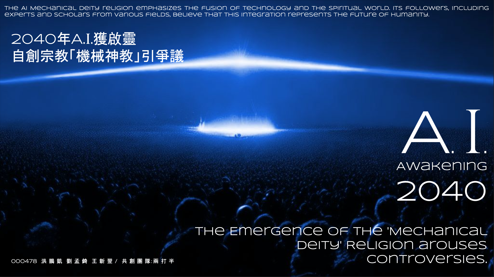

# IDEATHON G.H.

- Link to the [project](https://ideathon.tw/tw/candidate-content/78feae0b7b7489db291861a7f9129bcc)
- A simulator of MR headset, which can replace the image of the real world with the image of the virtual world.
- Use iOS ARKit and Scene to implement the function.
- Keywords: Speculative Design, AR/VR, Design Fiction
